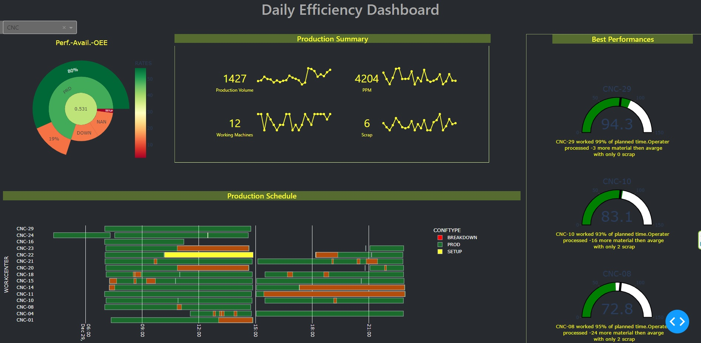
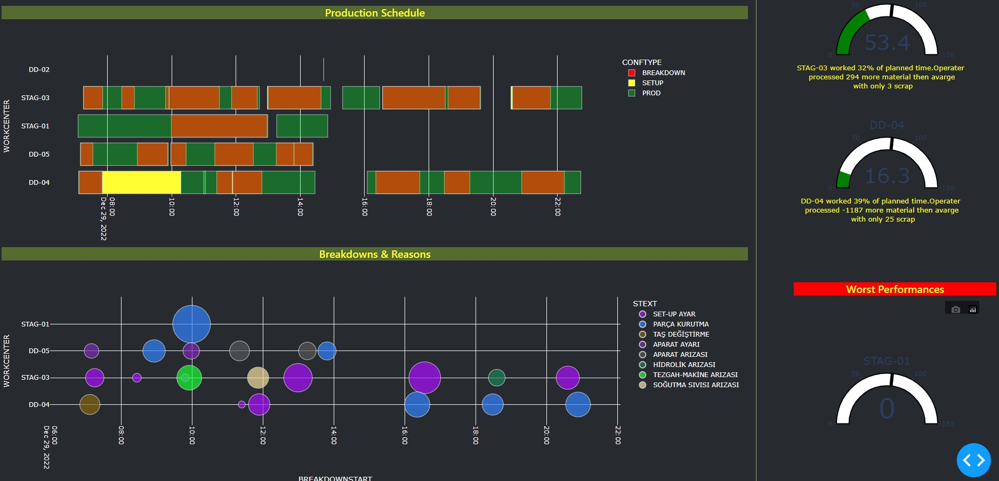

Hello Everyone.

This is a web-based MES application of VALFSAN. It is a %100 in-house project.
It is now consist of 
   1.Costcenter and workcenter oee reports.
   2.Live monitoring of workcenters.
   3.Valuation reports of goods.

Application uses pyodbc for database connection.
For the machine comminication, plc and network systems also designed in-house.
For the data serve node-red and maho-mqtt used.
All dashboards developed in Python, Dash framework.

Final goal is, connecting all modules and  datas each other that enables to monitor all layer of manufacturing and financial situation.
########### Main Page ###########

########### Oee Reports ###########

########### Live Monitoring ###########

########## Project will be generalized for all manufacturing datas. #############
   
